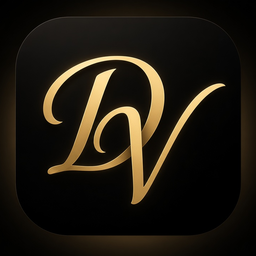

<div align="center">


# Dvoyna Vault
### High-Performance Local AI Image Manager
</div>

Dvoyna Vault is a local-first desktop app for organizing large AI-generated image libraries. It helps you import folders, browse fast, search by generation metadata, resolve model references, and keep library maintenance work on your own machine.

Dvoyna Vault is based on [Ambit](https://github.com/AsuraAce/ambit) by AsuraAce, licensed under GPL-3.0, with modifications. This fork uses its own bundle id (`com.dvoyna.vault`) and does not read or migrate an existing Ambit library.

<p align="center">
  
</p>

## Screenshots

| Light theme and advanced search | Timeline browsing |
| --- | --- |
|  |  |

| AI prompt recovery | Creative prompt variations |
| --- | --- |
|  |  |

## Key Features

*   **Local library management**: Catalog image folders without moving your source files, then review, remove, recover, and maintain records from one desktop workspace.
*   **Video library support**: Import supported local videos individually or through monitored folders, browse static posters, inspect ComfyUI metadata, and play or export originals. Playback depends on the Windows media runtime.
*   **Generation-aware metadata**: Parse prompts, workflows, resources, dimensions, hashes, and model references from common AI image outputs.
*   **Fast search and filtering**: Use SQLite-backed queries, facets, collections, and saved search state to stay responsive across large libraries.
*   **Performance-focused browsing**: Virtualized grids, thumbnail handling, and minimized IPC keep day-to-day browsing usable as collections grow.
*   **Optional intelligence tools**: Gemini-backed actions are available only when you configure your own key and explicitly run an AI feature.
*   **Privacy-conscious by default**: Core browsing, search, metadata parsing, thumbnails, and settings work locally without telemetry.

## Technology Stack

*   **Frontend**: React 19, TypeScript, Tailwind CSS, Zustand, React Query
*   **Backend**: Rust with Tauri v2 and SQLite (`rusqlite`)
*   **Desktop distribution**: GitHub Releases with Tauri updater artifacts

## Privacy and Network Behavior

Dvoyna Vault is local-first. Core library management, browsing, search, metadata parsing, thumbnails, maintenance, and settings work on local files without telemetry.

The public beta has a small set of disclosed network paths:

*   Automatic update checks are off by default. When enabled, they contact this fork's GitHub Releases. Packaged builds from the manual Windows workflow are not updater-signed, so those builds cannot install as automatic updates until a new signing key is configured. Updates are downloaded and installed only after you confirm the prompt.
*   Gemini features are optional. Requests are sent only when you configure a key and run an AI action or key verification.
*   CivitAI model-hash resolution is optional. It runs only after you confirm Resolve Online and sends unresolved model hash strings, not image files.
*   GitHub Sponsors, Ko-fi, and project links open only when clicked.

## Getting Started

### Public Beta Builds

Dvoyna Vault is currently in public beta. Current builds are published on [GitHub Releases](https://github.com/x0mirag0x/ambit/releases).

Official public beta builds are currently available for **Windows only** while macOS and Linux support is being validated.

Maintainer-triggered Linux and macOS artifacts may appear separately as experimental community test builds.

1.  Download the Windows setup installer (`-setup.exe`) from the release assets.
2.  Install and launch the app.
3.  Report bugs or feedback through [GitHub Issues](https://github.com/x0mirag0x/ambit/issues).

The Windows installer includes the packaged app. You do not need Node.js, pnpm, Rust, or VS Code unless you want to build Dvoyna Vault from source.

For a step-by-step product guide, see the [Dvoyna Vault User Manual](docs/manual/index.md).

### Development

For local development, Dvoyna Vault requires Node.js 24 or newer, pnpm 11.5.3, and Rust 1.96.0 as pinned by `rust-toolchain.toml`.

```bash
git clone https://github.com/x0mirag0x/ambit.git
cd ambit
pnpm install
pnpm run app:dev
```

For clean feature-video capture while retaining the development profile and tools, start the app in capture mode from PowerShell:

```powershell
$env:VITE_CAPTURE_MODE='true'
pnpm run app:dev
```

Capture mode hides the React Query control and title-bar `DEV` badge without disabling developer features. Clear the flag before returning to the normal development UI:

```powershell
$env:VITE_CAPTURE_MODE=$null
```

For checks, branch expectations, and maintainer workflow notes, see [CONTRIBUTING.md](CONTRIBUTING.md).

## Contributing

Dvoyna Vault is currently maintainer-led. Bug reports, documentation corrections, and feature requests are welcome, but code contributions and pull requests are not being accepted during the public beta.

See [CONTRIBUTING.md](CONTRIBUTING.md) for the current contribution policy.

For security-sensitive reports, follow [SECURITY.md](SECURITY.md) instead of opening a public issue.

## Support

Dvoyna Vault is free and open source. Support is optional and there are currently no paid-only features or priority-support tiers.

*   Report bugs and feature requests through [GitHub Issues](https://github.com/x0mirag0x/ambit/issues).
*   Follow packaged builds and release notes on [GitHub Releases](https://github.com/x0mirag0x/ambit/releases).
*   Support development through [GitHub Sponsors](https://github.com/sponsors/AsuraAce).
*   Leave a one-time tip on [Ko-fi](https://ko-fi.com/astraoriondev).

## License

Dvoyna Vault is based on Ambit by AsuraAce (https://github.com/AsuraAce/ambit), licensed under the GNU General Public License v3.0 only, with modifications. See [LICENSE](LICENSE) for details.
