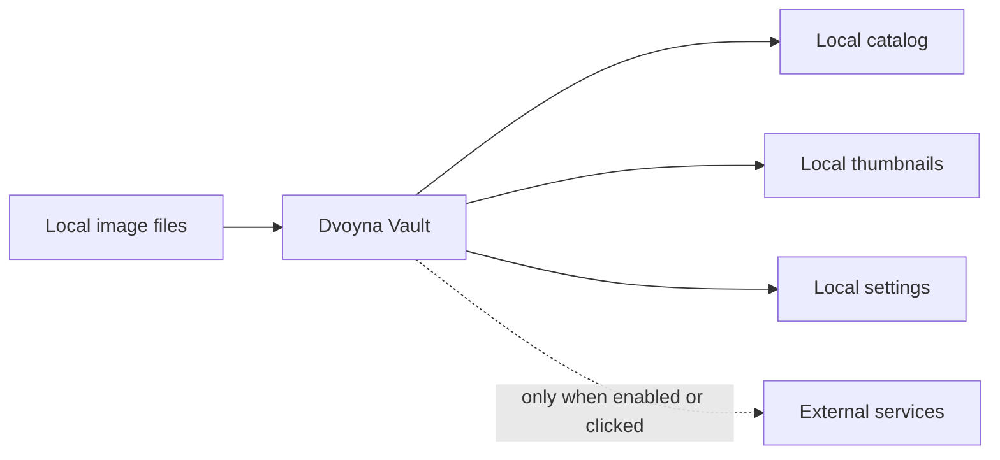

# Settings And Privacy

[Back to manual index](index.md)

Settings controls Dvoyna Vault's app preferences, integrations, privacy behavior, optional intelligence features, and advanced maintenance tools.

## Settings Sections

The Settings window contains:

- General: app-level preferences, including theme and interface language.
- Connections: folders, Resources, InvokeAI, SD WebUI, and ComfyUI setup.
- Intelligence: optional AI features and model/prompt configuration.
- Privacy: content masking behavior and masked keywords.
- Advanced: database, interface, update, and troubleshooting tools.
- Dev Tools: development-only tools when enabled.

For image generator setup details, see [Generator Integrations](generator-integrations.md). For model and resource folder setup, see [Assets And Resource Discovery](assets-resource-discovery.md).

## Language

General includes a language choice for the interface. Dvoyna Vault ships with English and Russian. On a first launch, Dvoyna Vault uses Russian when the system language is Russian and English otherwise. The choice is saved with the rest of your settings and kept for later launches. The product name Dvoyna Vault stays as Dvoyna Vault, and the rest of the interface follows the selected language.

## Local-First Behavior

Dvoyna Vault's core library management works locally. Browsing, search, metadata parsing, thumbnails, maintenance, and settings do not require telemetry.

## Network Behavior

The public beta has a small set of disclosed network paths:

- Automatic update checks are off by default. When enabled, they contact this fork's GitHub Releases. Updates install only after you confirm the prompt. An unsigned Windows installer cannot be installed as a signed update.
- Gemini features are optional and use your own key. Requests are sent only when you verify a key or run an AI action.
- CivitAI model-hash resolution is optional. It runs only after you confirm Resolve Online and sends unresolved model hash strings, not image files.
- GitHub Sponsors, Ko-fi, repository, and project links open only when clicked.

## Privacy Controls

Open Settings, then Privacy to configure content masking.

You can choose:

- Privacy Mode: the session master switch for every masking source. It starts enabled whenever Dvoyna Vault launches.
- Use prompt keywords: add positive-prompt keyword matches as an optional masking source. This preference persists across restarts.
- Blur Content: keep matching images visible but blurred.
- Hide Completely: hide matching images from normal browsing.

Manual image masks are always a masking source while Privacy Mode is on. Prompt keywords are matched against positive prompts only while Use prompt keywords is enabled. Blur Content or Hide Completely applies to both sources. Turning Privacy Mode off temporarily reveals both sources for the current session.

You can continue to view and edit the saved keyword list while Use prompt keywords is disabled. Turning it off in Settings or the setup guide retains the complete custom list. Restarting Dvoyna Vault or replaying setup keeps both the switch state and saved list. Re-enabling uses that same list; if the list is empty, no prompts match until you add a keyword. Purge Database is a factory reset and restores prompt keywords with Dvoyna Vault's default list and Blur Content behavior.

Reopen setup through **Help & Guide > Setup Guide**. Replay is dismissible and saves only guide controls you explicitly change. It does not reset masking behavior, keywords, or unrelated preferences.

## Intelligence Features

Intelligence features are off unless configured. When enabled, Dvoyna Vault can use Gemini for tasks such as prompt analysis or variation ideas. These actions are on-demand and depend on your own Gemini API key.

Create or view a key in [Google AI Studio](https://aistudio.google.com/apikey). A free tier is available for eligible accounts and regions, with model and usage limits. Keys entered through Dvoyna Vault are stored in the OS keyring; credentials supplied through the environment are read but not saved by Dvoyna Vault. Images or prompts are sent to Google only when you verify the key or run a Gemini feature, and Google handles those requests under the terms of your AI Studio plan.

A securely stored key is shown as **API key configured** when you return to onboarding or Settings. **API key verified and saved** confirms a successful verification in the current session; it does not guarantee that Google will continue accepting the key indefinitely.

If an AI action fails, confirm that the key is saved, the key verifies successfully, and the network is available.

## Advanced Tools

Advanced includes:

- backup settings
- automatic update controls
- support diagnostics, including the active library database and app log locations
- database reset tools

Development builds provide **Reset first-run onboarding** under Dev Tools for testing the non-dismissible first-run experience. It changes only the onboarding completion state and is not exposed in release builds.

The database location shown in Support Diagnostics is the local catalog path, not the Dvoyna Vault installer path. On Windows, Dvoyna Vault stores the catalog under Local AppData and may show a legacy Roaming AppData fallback only for older installs that could not be moved automatically.

Support Diagnostics also shows the app log file location. Use Show Logs Folder or Copy Diagnostics when collecting details for an issue; the copied diagnostics include paths and aggregate counts, not image prompts or metadata.

Use Purge Database only when you intentionally want to remove all imported metadata and reset application state. The confirmation explains that source image files are not touched, but Dvoyna Vault's catalog and linked folders are reset.

## Next Step

For common fixes, continue with [Troubleshooting](troubleshooting.md).
